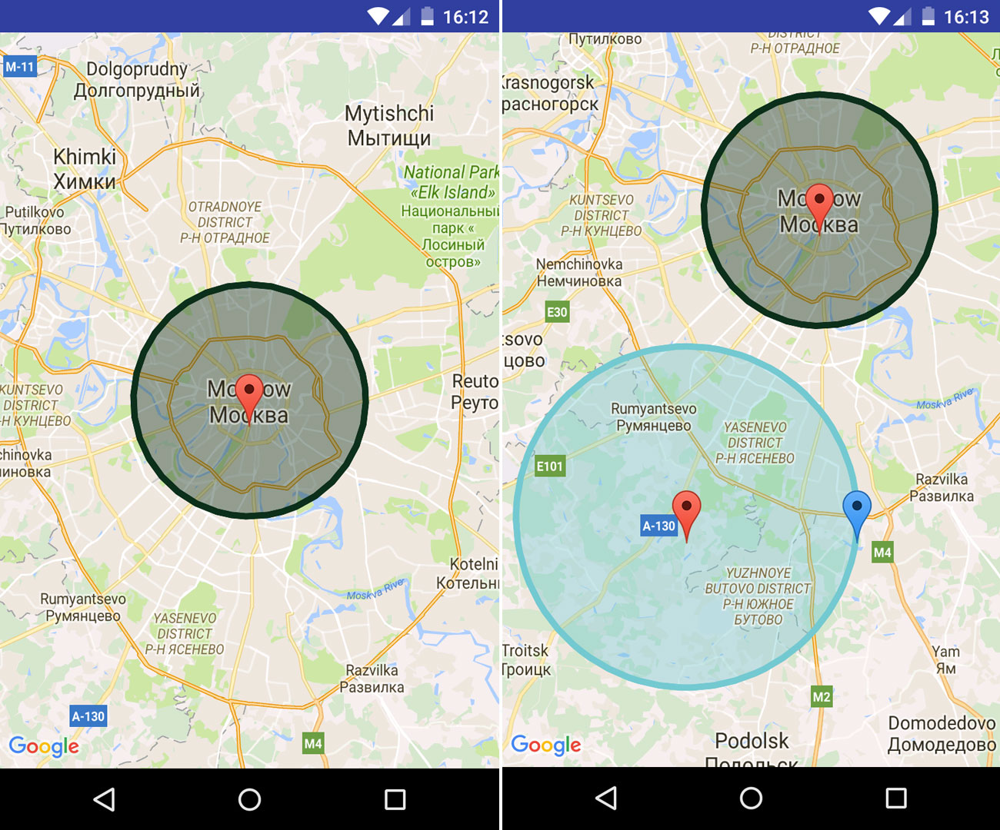

[](https://jitpack.io/#yaroslav-v/android-maps-zone) [](https://android-arsenal.com/api?level=14)

# Editable geo zones for Google Maps Android



Simply create, resize or move geo zone on Google Maps. Based on Google Maps markers and shapes.

Gestures (show mode):

- Hold map for 2 second (long click) to create zone
- Hold center marker of existent zone for 2 seconds to enter in edit mode

Gestures (edit mode):

- Hold center marker for 2 seconds to change zone location
- Hold side marker for 2 seconds to resize zone

# Demo

Demo apk you can find in the /app folder of this repository.

# Features

* Create, resize or move geo zone
* Supports Point, Circle and Polygon (convex polygon) shapes
* Utils to calculate bounds etc. of shapes

# Usage

Create Circle shape with given center point and radius.
```java
DraggableShape draggable = new DraggableCircle(mMap, // GoogleMap instance
        center, // LatLng coordinate of center point
        radius, // double radius of circle
        strokeColor, // int stroke Color
        fillColor, // int fill Color
        strokeWidth, // float stroke width 
        centerResource, // BitmapDescriptor for central marker
        radiusResource); // BitmapDescriptor for side marker
```

Implement `GoogleMap.OnMarkerDragListener` to interact with geo zones:
```java
@Override
public void onMarkerDragStart(Marker marker) {
    draggable.onMarkerMoveStart(marker);
}

@Override
public void onMarkerDrag(Marker marker) {
    draggable.onMarkerMove(marker);
}

@Override
public void onMarkerDragEnd(Marker marker) {
    draggable.onMarkerMove(marker);
}
```

# Download

Step 1. Add the JitPack repository to your build file.
```
repositories {
    // ...
    maven { url "https://jitpack.io" }
}
```

Step 2. Add the dependency.
```
dependencies {
    compile 'com.github.yaroslav-v:android-maps-zone:v1.0.0'
}
```

That's it! The first time you request a project JitPack checks out the code, builds it and serves the build artifacts. 

# Copyright
```
Copyright 2016 Yaroslav Veykov, Genie in a Bottle studio

Licensed under the Apache License, Version 2.0 (the "License");
you may not use this file except in compliance with the License.
You may obtain a copy of the License at

http://www.apache.org/licenses/LICENSE-2.0

Unless required by applicable law or agreed to in writing, software
distributed under the License is distributed on an "AS IS" BASIS,
WITHOUT WARRANTIES OR CONDITIONS OF ANY KIND, either express or implied.
See the License for the specific language governing permissions and
limitations under the License.
```
